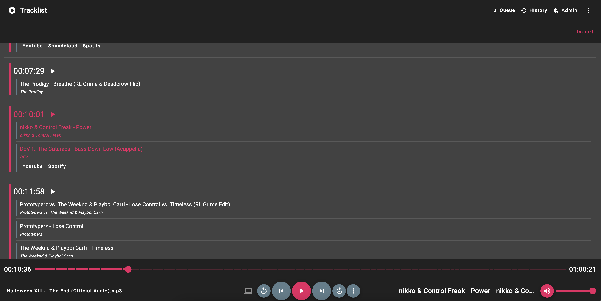

# Mix Server

Mix Server is a web based audio player intended for listening to long audio files such as DJ mixes without losing track of your progress
using a simple file explorer based UI.

Before developing this project I struggled to find an audio player that satisfied the following.

1. Remembered my progress through a mix
2. Had an option to view my files through a file explorer rather than through ID3 tags.
3. Was available on all my devices



## Features

- __Progress tracking__: Mix Server will keep track of progress in an audio file so you can pick up where you left off
- __File Explorer UI__: Rather than having to meticulously tag all your MP3 files view them through a file explorer
- __Multi Device Control__: Listen on your phone whist controlling playback from your computer, as well as being able to seamlessly transfer playback to another device
- __User Management__: Create multiple users who can each keep track of there own progress
- __History__: View a history of all the files you have listened to
- __Queue__: Queue audio from any folder to be played next

## Installation

The easiest way to install Mix Server is through Docker Compose.

Here is an example docker-compose.yml

```yaml
version: "3.5"

services:
  mix-server:
    hostname: mix-server
    container_name: mix-server
    image: ambrevar/mix-server
    restart: unless-stopped
    networks:
      - mix-server-network
    ports:
      - "5225:5225"
    environment:
      - DOTNET_ENVIRONMENT=Production
      - ASPNETCORE_URLS=http://+:5225
      - MIX_SERVER_HostSettings__ValidUrls=https://mix-server.example.com
      - MIX_SERVER_RootFolder__Children=/media
    volumes:
      - mix-server-media:/media
      - mix-server-data:/data

networks:
  mix-server-network:

volumes:
  mix-server-data:
  mix-server-media:
```

- **DOTNET_ENVIRONMENT**: Either `Development` or `Production` if you're just hosting the app keep this as `Production`
- **ASPNETCORE_URLS**: The URL you want the server to be hosted on
- **MIX_SERVER_HostSettings__ValidUrls**: Valid URLs clients can access the UI on. Add multiple using `;` as a separator
- **MIX_SERVER_RootFolder__Children**: Set this to the folders you want to access via the UI. In the example above this is set to `/media` as that's where `mix-server-media` is mounted. You can mount multiple locations using `;` as a seperator
- **/data**: Is the location where Mix Server's database and config is held. Mix Server currently uses SQLite as its data store

For further configuration see 
- [appsettings.json](src/api/MixServer/appsettings.json)
- [appsettings.Development.json](src/api/MixServer/appsettings.Development.json)

## Developing

Mix Server is developed using ASP.NET Core 8.0 and Angular 17. Using Powershell Core for development scripts

1. Download .NET 8.0 SDK and Node.js LTS and Powershell Core
2. Open the client (`src/clients/mix-server-client`) project and run the following
   1. `npm install`
   2. `ng build`
   3. `ng serve`
3. Open the API Project (`MixServer.sln`)
   1. Run `pwsh scripts/link_wwwroot.ps1`
   2. Create a data directory in the root of the repo
   3. Create a `appsettings.Local.json` file and specify your media directory
```json
{
    "RootFolder": {
        "Children": "./media"
    }
}
```
4. Run the project
5. Access the angular UI on `http://localhost:4200` and the API on `http://localhost:5225`

### Regenerating API Clients

If you make a change to an API Controller / DTO / SignalR Dto you will need to regenerate the API client.

Run `scripts/regenerate_api_clients.ps1` to regenerate the clients